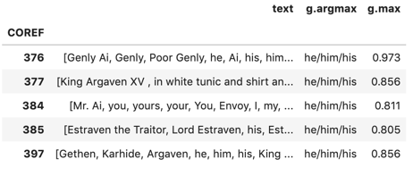

# (Mis)classifying Gender in Speculative Fiction

## Background
This project is a continuation of work started by Underwoood et. al looking at gendered characters in fiction.
Their project used U.S. Census data to assign gender to names, which only allowed them to look at binary male/female
classifications and was imperfect for names that could be associated with more than one gender, like Charlie or Sammy.

Since that time, BookNLP has evolved to include character genders through association with pronouns usage in the novels,
calculating gender probability using the expectation maximization (EM) method. BookNLP can now produce data associated
with pronouns beyond binary classification, such as they/them, and neopronouns like ze/zem. This means that we can update
the original work with the new outputs in order to look at a broader spectrum of gender in literature.

For this particular project, we were interested in doing a case study for novels that we knew had non-binary and/or trans
characters. We initially identified a corpus of 40 English language, 20th century speculative fiction books that explored
gendered norms. Speculative Fiction is category of fiction that encompasses elements of genre that do not exist in reality,
recorded history, nature, or the present universe. This usually encompasses genres like science fiction, fantasy, dystopian,
alternative historical fiction, and horror. This genre was chosen because of its exploratory nature, meaning stories are more
likely to experiment with gender and pronouns. Though we submitted a list of 40 books to the HathiTrust, only 25 books
were available at the time of publishing.

## Methods
BookNLP produces 4 tables per book, which is what we are working with. We are not interested in the specifics of the NLP
project, but rather what can be done with the output and what it can tell us about fiction and gender. Only 2 of the 4 
tables were of specific interest to us: the entity table (describing important "nouns" of the story) and the book table
(keeping track of information about each of the entities). We created a data pipeline that allows us to merge the
“entities” table (tsv of people, places, and objects) with the “book” table (JSON of character actions, relationships,
and gender inferences) into one table with a unique entity reference.

This looks like:
* Given list of characters we care about (currently hand coded, could later be based on number of mentions) find the coded reference numbers associated with each character
* Filter entities list to only include those reference numbers
* Merge filtered entity and book table
* Group by reference number, keeping all unique text and the maximum gender measurements (a.k.a. The statistically predicted gender pronouns)

For example, this is the table produced for the book _The Left Hand of Darkness_ by Ursula K. LeGuin.

## Analysis
 * to-do: 
   * insert graphs for relationship between author gender and character gender
   * insert graphs for character gender proportions
   * insert graphs for general character counts

## Conclusion and Next Steps
We can see the value in rerunning this pipeline through our selected case studies, given that characters are using non-binary
pronouns in this corpus and that BookNLP is generally accurate in its gender classifications, even when characters have
ambiguous names or names that may not appear in the U.S. Census data, which is an improvement over previous limitations.

There are still limitations in this project as well, however. For example, there are sources of noise that should likely
be removed. Non-gendered pronouns, like "I" or "you," are currently split evenly across all pronoun categories. Overall, 
this does not seem to effect the general accuracy of the predictions, but it does mean a story told in the 2nd person may
have less confident predictions.

In addition, this was a case study. As such, we need to greatly expand the corpus of books. This will give us much more
data and allow for proper statistical testing of our hypotheses. The current data also stops at 1999, meaning more recent
evolutions in writing about gender are not being captured. We hypothesize that we will see an increased use of non-binary
characters post-2000 and would very much like to include these works.

We are fairly confident that this pipeline is generalized and usable, but that remains to be tested once we receive more data.

## References

Ted Underwood, David Bamman, and Sabrina Lee, “The Transformation of Gender in English-Language Fiction.” Cultural Analytics. February 13, 2018. 

Gaye Tuchman, and Nina E. Fortin, Edging Women out: Victorian Novelists, Publishers, and Social Change. Yale University Press. 1989.
